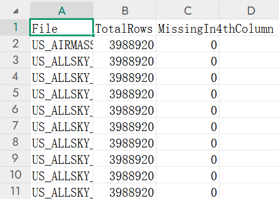

# QF5214_G6_PORJECT
## Introduction
In commodity futures trading, the monitoring and prediction of crop growing conditions is crucial. Environmental factors such as precipitation, temperature, and solar radiation have a significant impact on crop yields and quality. For instance, research suggests that roughly 20% of the increase in Iowa corn yields over recent decades can be attributed to enhanced solar radiation (solar brightening). Fluctuations in these variables alter the fundamental supply-demand balance of agricultural commodities, making weather one of the key determinants of commodity prices. Unpredictable weather often leads to volatile crop prices, as the agricultural sector is highly vulnerable to climate variability. Likewise, extreme weather events can cause surges in crop insurance claims: in severe drought years, insurance payouts have exceeded premiums, and when disasters affect large swaths of farmland, yield losses drive up commodity prices and result in more frequent and costly insurance indemnities. Therefore, reliably monitoring and forecasting these environmental variables is of paramount importance for anticipating future market trends and informing agricultural insurance compensation strategies.  

NASA POWER project addresses this need by providing high-resolution meteorological and solar radiation data with global coverage. The POWER project aggregates NASAs Earth observation data on surface solar irradiance and various meteorological parameters, offering free and convenient access to these data for users worldwide. NASA POWER datasets have been used to support applications in renewable energy, building energy efficiency, and agricultural analyses, making them valuable for evaluating crop-growing environments. By leveraging this authoritative data source, researchers and practitioners can more accurately characterize field-level climate conditions, supplying reliable inputs for commodity market analysis and agricultural risk modelling.  

This study leverages daily meteorological and solar radiation data from the continental United States (excluding Hawaii and Alaska), sourced from NASA POWER between January 1, 2018, and December 31, 2024, to establish a multi-dimensional environmental database and develop time-series forecasting models. To dynamically predict trends in critical environmental parameters, we implemented a multi-task Long Short-Term Memory (LSTM) architecture for joint modelling. Building on these predictions, we innovatively developed an "Environmental Risk Index" to quantitatively characterize integrated environmental impacts. The index formulation adopts a dual-strategy approach, independently calculating results using both the classical Entropy Weight Method and an AI-assisted weighting scheme powered by OpenAI’s interface. Notably, the system incorporates a spatiotemporal query module that enables users to retrieve real-time index values for specified geographic coordinates and timeframes through an interactive interface.

## STEP1: US_GETALL_DAILY.py
The `US_GETALL_DAILY.py` script is designed to connect to the NASA POWER database API for automated data retrieval. This script allows users to specify the target variables, which will then be sequentially fetched from the NASA POWER API. After successful data extraction, the retrieved data for each variable will be saved locally as CSV files for further analysis or processing.

## STEP2: DATA_QUALITY_CHECK.py
The `DATA_QUALITY_CHECK.py` script is used to check the missing values and abnormal values within each variable of the dataset. It helps ensure data completeness and quality before further analysis.

After completing the data retrieval process for all variables, running this script will generate:

- A summary CSV file containing missing value statistics for all variables: `Data_Quality_Summary.csv`
- A visualization showing the distribution of abnormal data ratio across all files: `Bad_Ratio_Distribution.png`

### Output Example

#### 1. Data Quality Summary Table
This file records the number and proportion of missing and abnormal values for each variable.

#### 2. Bad Ratio Distribution Plot
This figure shows the distribution of abnormal data ratio across all generated CSV files.

## STEP3: DATA_CLEAN.py

The `DATA_CLEAN.py` script is designed to perform spatial interpolation to fill missing values in the selected variable datasets. 

By running this script, each filtered variable's CSV file will be processed individually. Missing values will be filled using spatial interpolation techniques, and the completed datasets will be saved into a new output directory for further usage.

In addition, the script will generate a visualization showing the repair ratio (i.e., the proportion of missing values that have been filled) for each variable.

### Output Results

- Completed CSV files for each variable (after missing value interpolation)
- A visualization showing the repair ratio of each variable: `Repair_Ratio_Per_Variable.png`

#### Example of Repair Ratio Distribution

## STEP4: DATA_FILLNAN.py

The `DATA_FILLNAN.py` script is designed to handle the remaining missing values that cannot be filled by spatial interpolation methods — typically those located at the edges of the data grid.

By running this script, all the variable datasets will be further processed to ensure complete filling of missing values. This guarantees that the final data files are fully completed without any remaining NaN values.

### Key Features
- Handle missing values that remain after spatial interpolation (e.g., edge regions).
- Ensure 100% completeness of all variable datasets.
- Output fully filled CSV files for each variable.

## STEP5: DATA_CHECK.py

The `DATA_CHECK.py` script is used to visually and quantitatively verify that all variable datasets have been fully completed, with no remaining missing values.

By running this script, the completeness of each variable's data is checked and visualized. In the end, it will generate a summary file `Missing_Summary.csv` to confirm that all variables contain no missing values (NaN = 0).

### Output Results

- A summary CSV file showing the final missing value status of all variables: `Missing_Summary.csv`

#### Example of Final Missing Value Check

This file clearly demonstrates that all variable datasets have been successfully filled and no missing values remain.

## STEP6: DATA_MERGE.py

The `DATA_MERGE.py` script is used to merge the processed variable datasets based on their respective categories (e.g., Meteorology and Radiation).

Although this merging step could also be performed directly during the database upload, due to the instability of the Alibaba Cloud database connection at that time, we chose to complete the merging locally.

After merging, the combined datasets are saved separately by category. Additionally, the script performs another round of missing value checks on the merged datasets to ensure data integrity.

### Output Results

- Merged data files categorized by variable types (e.g., Meteorology, Radiation)
- Missing value check for merged data
- Visualizations showing the missing value ratio of each merged file:
  - `Meteorology_Missing_Ratio_Barplot.png`
  - `Radiation_Missing_Ratio_Barplot.png`

#### Example of Missing Ratio Check

The figures below show the missing value ratio for each merged file. The missing ratio is 0 for all variables, confirming that the data is complete and ready for further analysis.

##### Meteorology Missing Ratio

##### Radiation Missing Ratio

## STEP7: DATA_DATABASE.sql

The `DATA_DATABASE.sql` file contains SQL scripts used to connect to the Alibaba Cloud MySQL database instance and create the required tables for subsequent data upload.

These tables are designed according to the structure and categories of the processed datasets (e.g., Meteorology, Radiation), ensuring seamless integration with the data generated in previous steps.

By executing this script in MySQL, all necessary tables will be automatically created in the designated database, providing a structured and ready-to-use environment for data storage and management.

### Key Functions
- Connect to Alibaba Cloud MySQL database
- Automatically create required tables
- Prepare the database for efficient data upload and query

## STEP8: DATABASE_UPLOAD.py

The `DATABASE_UPLOAD.py` script is used to establish a connection with the Alibaba Cloud MySQL database and upload the finalized local data files into their corresponding database tables.

During the upload process, the script redefines the treatment rules for missing values and abnormal values to ensure consistency and data integrity. This is particularly important to support future real-time data updates or scheduled synchronization with external sources.

### Key Functions
- Connect to Alibaba Cloud MySQL database
- Upload finalized local CSV data into structured tables
- Re-define missing and abnormal value handling rules
- Ensure consistency for future real-time data updates

## STEP9: Data_Loader.py & Model.py

The `Data_Loader.py` and `Model.py` scripts are designed for cloud-based data retrieval and time series forecasting using LSTM (Long Short-Term Memory) models.

These scripts provide a complete workflow for data analysts to automatically fetch the required data from the cloud database, build the LSTM model, and perform forecasting tasks on the selected target variables.

### Key Workflow

1. `Data_Loader.py`
   - Connects to the cloud database
   - Retrieves the specified target variables
   - Prepares and processes data for modeling

2. `Model.py`
   - Builds and trains LSTM forecasting models
   - Performs daily predictions for the next month (future 30 days)
   - Evaluates model performance using metrics like MSE (Mean Squared Error)
   - Visualizes prediction results and model evaluation

---

### Output Results

- Forecasted values for the next month (daily frequency)
- Model evaluation metrics (e.g., MSE)
- Visualization of historical vs. predicted values

#### Example of Prediction Visualization

## STEP10: INDEX_AI_EXPERT_WEIGHT.py

The `INDEX_AI_EXPERT_WEIGHT.py` script is used to assign AI expert-based weights to each variable, leveraging OpenAI's API for intelligent scoring.

This script automatically interacts with OpenAI's GPT model, providing carefully designed prompts based on the description of each variable. The AI expert evaluates both the importance (weight) and the impact direction (positive or negative) of each variable.

### Input Files
- `Index_Meteorology.csv` — Contains the names and descriptions of meteorological variables.
- `Index_Radiation.csv` — Contains the names and descriptions of radiation variables.

### Key Functions
- Automatically generate prompts based on variable descriptions.
- Interact with OpenAI API for expert scoring.
- Assign weight values and impact direction for each variable.

---

### Output Results

- `AI_Assigned_Index_Weight.csv` — Contains AI-generated weight values and impact directions for all variables.

| Column | Description                        |
|--------|------------------------------------|
| Variable | Name of the variable             |
| Weight   | AI-assigned importance weight    |
| Impact   | Impact direction (Positive / Negative) |

## STEP11: Agri_Index_AI.py

The `Agri_Index_AI.py` script is designed to calculate the AI Expert Environmental Index for agriculture by integrating AI-assigned weights with real-world data from the Alibaba Cloud database.

This script connects to the Alibaba Cloud MySQL database, retrieves the required variable data, and uses the previously generated AI expert weights (`AI_Assigned_Index_Weight.csv`) to calculate a comprehensive environmental index for each location and date.

The calculated index values are then written back to the database for future queries and analysis. At the same time, local CSV files containing the index results are also generated for backup or further analysis.

---

### Key Functions
- Connect to Alibaba Cloud MySQL database
- Retrieve variable data for index calculation
- Combine AI-assigned weights with database data
- Calculate AI Expert Environmental Index
- Upload calculated index back to database
- Export local result files for storage

---

### Output Results

- Index data written into the designated table in the Alibaba Cloud database
- Local output file:
  - `Agri_Index_AI.csv` — Contains calculated AI Environmental Index data for all locations and timestamps.

---

#### Example of Index Data Output

| Latitude | Longitude | Timestamp | AI_Environmental_Index |
|----------|-----------|------------|------------------------|
| 34.5     | -98.2     | 2024-01-01 | 0.78                   |
| 34.5     | -98.2     | 2024-01-02 | 0.82                   |

## STEP12: INDEX_UI

The `INDEX_UI` module implements a web-based user interface for real-time querying and visualization of the AI Expert Environmental Index, based on data stored in the Alibaba Cloud MySQL database.

This interactive web application allows users to:

- Query the AI Environmental Index at any specific **location** and **timestamp**
- View a full **national heatmap** of the index for the selected date
- Retrieve all **meteorological station-level index values** across the United States at that time

The system is designed to support both individual point queries and comprehensive spatial analysis, making it useful for analysts, policymakers, and researchers in agriculture and environmental monitoring.

---

### Key Features

- **Interactive Query**  
  Search for any (Latitude, Longitude, Timestamp) combination to retrieve the corresponding AI Environmental Index.

- **National Heatmap Generation**  
  Automatically generates a heatmap showing the AI Index across the United States for the selected timestamp.

- **Station-Wide Index Snapshot**  
  Displays the AI Index values for all meteorological stations at that moment.

- **Real-time Database Connection**  
  Powered by Alibaba Cloud MySQL for up-to-date data access.

---

### Output Examples

#### 1. Individual Query Output

#### 2. National Heatmap

#### 3. Station-Wide Snapshot Table

---

### Deployment Notes

- Built using `Flask` + `Bootstrap` (or other framework as applicable)
- Requires valid connection to Alibaba Cloud database
- Compatible with desktop and tablet browsers

## Conclusion
This study demonstrates the advanced integration and application of database systems in the field of environmental and natural resource analysis. By systematically collecting and processing datasets related to weather and solar radiation, and incorporating state-of-the-art data processing techniques, the research significantly enhances the efficiency of environmental resource forecasting and visualization. Importantly, it also provides decision-support functions tailored to financial practitioners who may not possess a background in environmental or geosciences. These efforts contribute to a more nuanced understanding of the relationship between meteorological indicators and environmental resources, thereby improving insight into sectors with high environmental dependency, such as agricultural insurance and commodity trading.
